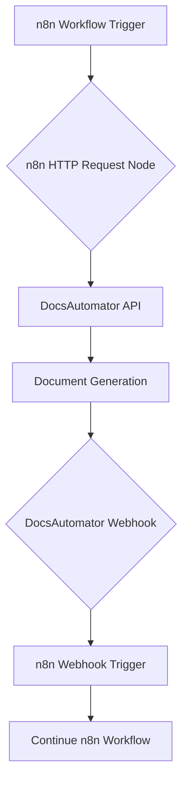

# DocsAutomator Integration Architecture and Flexible Template Design

## 1. Proposed Integration Architecture: Direct n8n to DocsAutomator API

Based on the research, the most efficient and recommended approach is to integrate n8n directly with the DocsAutomator API using the n8n HTTP Request node. This architecture avoids the unnecessary complexity and potential latency of using Zapier as an intermediary.

### Workflow Diagram

### Step-by-Step Workflow

1.  **Trigger the n8n Workflow:** The process begins with an n8n workflow trigger. This could be a manual execution, a scheduled trigger, or a webhook from another application.

2.  **Call DocsAutomator API:** An n8n **HTTP Request Node** is used to make a `POST` request to the DocsAutomator `/createDocument` endpoint. The request will contain the `docId` of the desired template and the dynamic `data` to populate the placeholders.

3.  **Document Generation:** DocsAutomator receives the API request and generates the document based on the provided template and data.

4.  **Webhook Notification (Recommended):** Upon successful document creation, DocsAutomator sends a webhook notification to a specified URL. This is a more robust method than relying on a synchronous API response, especially for complex documents that may take longer to generate.

5.  **Receive Webhook in n8n:** A separate n8n workflow with a **Webhook Trigger** is set up to listen for the notification from DocsAutomator. The webhook payload will contain the URLs of the generated PDF and Google Doc.

6.  **Continue Workflow:** The second n8n workflow can then proceed with subsequent actions, such as sending the document via email, updating a CRM, or storing the document URL in a database.

## 2. Flexible DocsAutomator Template Design

To accommodate a variety of document types, a flexible and generic Google Doc template can be created using DocsAutomator's advanced features.

### Template Structure

**Document Title:** `{{document_title}}`

**Recipient Information:**
*   Name: `{{recipient_name}}`
*   Company: `{{recipient_company}}`
*   Address: `{{recipient_address}}`

**Introduction Section (Conditional):**
`{{section_introduction}}`
`{{introduction_text}}`
`{{/section_introduction}}`

**Main Content:**
`{{main_content}}`

**Financials Section (Conditional):**
`{{section_financials}}`
| Description | Quantity | Unit Price | Total |
| --- | --- | --- | --- |
| `{{line_items_1}}{{description}}` | `{{quantity}}` | `{{unit_price}}` | `{{total}}` |
`{{/section_financials}}`

**Legal Section (Conditional):**
`{{section_legal}}`
`{{legal_text}}`
`{{/section_legal}}`

**Conclusion:**
`{{conclusion_text}}`

### How it Works

*   **Generic Placeholders:** The template uses generic placeholder names like `{{document_title}}` and `{{recipient_name}}` that can be adapted to any document type.

*   **Conditional Sections:** The `{{section_...}}` tags define blocks of content that can be included or excluded based on the data sent in the API call. For example, the `financials` section will only be rendered if the API request includes a `financials` flag.

*   **Line Items:** The `line_items_1` placeholder allows for the dynamic creation of tables for financial data or other itemized lists.

*   **Dynamic Content:** The content for each placeholder and section is provided in the `data` object of the API request, allowing for complete customization of the final document.

By using this architecture and template design, you can create a powerful and flexible document automation system that can be easily managed and extended within your n8n workflows.
