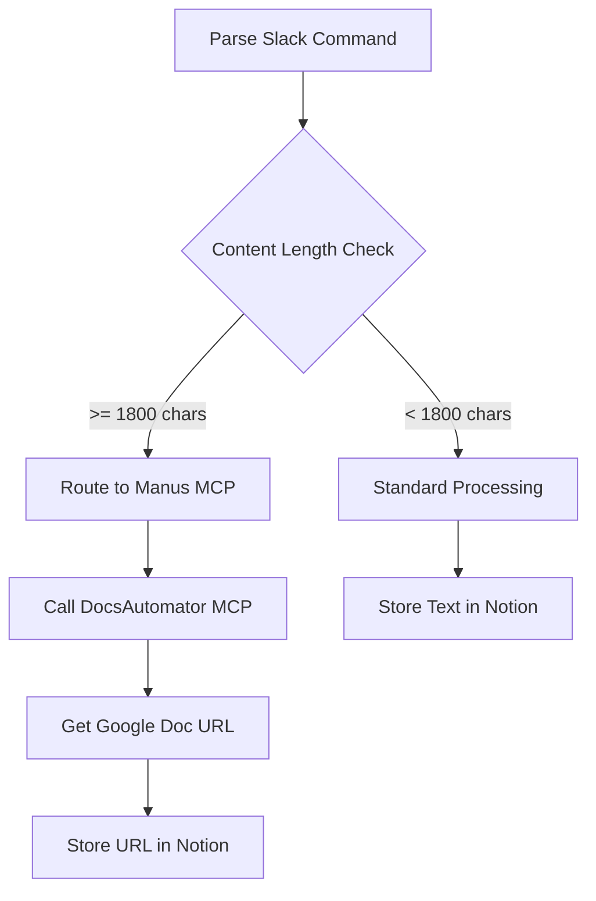

# n8n MCP Integration - Production Ready

## 🎉 MCP Servers Deployed and Tested

Both MCP servers are now live on Railway and fully operational!

### DocsAutomator MCP Server
- **URL**: `https://web-production-14aec.up.railway.app`
- **Status**: ✅ Operational
- **Available Templates**:
  - Course Package Template: `68d7b000c2fc16ccc70abdac`
  - AAE Agent Content Automation: `69088da6d852c9556cec26af`

### Gamma MCP Server
- **URL**: `https://web-production-b4cb0.up.railway.app`
- **Status**: ✅ Operational
- **Test Generation**: https://gamma.app/docs/72fhw93ts23yu66

---

## n8n Workflow Integration

### Workflow Architecture for Long-Form Content

When content exceeds 1800 characters, route to Manus MCP for document generation:



---

## Step 1: Add Content Length Check Node

In your "AI Command Router" workflow, after the "Parse Slack Command" node:

### Node: "Check Content Length"
**Type**: IF Node

**Expression**:
```javascript
{{$json.command_text.length >= 1800}}
```

**Outputs**:
- `true` → Route to Manus MCP
- `false` → Standard processing

---

## Step 2: Add DocsAutomator HTTP Request Node

Connect to the `true` output of "Check Content Length":

### Node: "Call DocsAutomator MCP"
**Type**: HTTP Request Node

**Configuration**:
- **Method**: POST
- **URL**: `https://web-production-14aec.up.railway.app/create_document`
- **Authentication**: None (API key is in the MCP server environment)
- **Send Body**: Yes
- **Body Content Type**: JSON

**Body**:
```json
{
  "docId": "68d7b000c2fc16ccc70abdac",
  "documentName": "{{$json.user_name}} - {{new Date().toISOString().split('T')[0]}}",
  "data": {
    "document_title": "{{$json.notion_title || 'Task from Slack'}}",
    "generation_date": "{{new Date().toLocaleDateString()}}",
    "main_content": "{{$json.command_text}}"
  }
}
```

**Expected Response**:
```json
{
  "pdfUrl": "https://firebasestorage.googleapis.com/...",
  "googleDocUrl": "https://docs.google.com/document/d/...",
  "savePdfGoogleDriveFolderId": "..."
}
```

---

## Step 3: Update Notion Node for Long Content

After "Call DocsAutomator MCP", modify the Notion node:

### Node: "Log to Notion (Long Content)"
**Type**: Notion Node

**Properties**:
- **Conversation Title**: `{{$node["Parse Slack Command"].json.notion_title}}`
- **Content Type**: `URL` (instead of `Text`)
- **Document URL**: `{{$json.googleDocUrl}}`
- **User**: `{{$node["Parse Slack Command"].json.user_name}}`
- **Channel**: `{{$node["Parse Slack Command"].json.channel_id}}`
- **Priority**: `{{$node["Parse Slack Command"].json.priority}}`

---

## Step 4: Add Gamma Integration (Optional)

For presentation generation requests:

### Node: "Generate Gamma Presentation"
**Type**: HTTP Request Node

**Configuration**:
- **Method**: POST
- **URL**: `https://web-production-b4cb0.up.railway.app/generate`
- **Body Content Type**: JSON

**Body**:
```json
{
  "inputText": "{{$json.command_text}}",
  "format": "presentation",
  "numCards": 12,
  "additionalInstructions": "Create a professional presentation with clear structure"
}
```

**Then add a follow-up node to check status:**

### Node: "Check Gamma Status"
**Type**: HTTP Request Node (triggered after 10-second wait)

**Configuration**:
- **Method**: GET
- **URL**: `https://web-production-b4cb0.up.railway.app/generations/{{$json.generationId}}`

**Response includes**:
```json
{
  "status": "completed",
  "gammaUrl": "https://gamma.app/docs/...",
  "pdfUrl": "..." (if requested)
}
```

---

## Routing Logic Recommendations

Add a **Switch Node** after "Parse Slack Command" to route based on task type:

### Node: "Route Task Type"
**Type**: Switch Node

**Routing Rules**:

**Output 1 - Document Generation**:
```javascript
{{$json.command_text.length >= 1800 || $json.command_text.toLowerCase().includes('document') || $json.command_text.toLowerCase().includes('report')}}
```
→ Route to DocsAutomator MCP

**Output 2 - Presentation Generation**:
```javascript
{{$json.command_text.toLowerCase().includes('presentation') || $json.command_text.toLowerCase().includes('slides') || $json.command_text.toLowerCase().includes('deck')}}
```
→ Route to Gamma MCP

**Output 3 - Standard Processing**:
→ Route to existing GitHub/CC workflow

---

## Integration Benefits

✅ **Zero Zapier Cost**: Direct n8n → Railway MCP integration
✅ **Automatic Scaling**: Railway handles traffic spikes
✅ **Persistent URLs**: No more localhost dependencies
✅ **Professional Output**: Google Docs and Gamma presentations
✅ **Notion Character Limit Bypass**: Store URLs instead of full text

---

## Testing the Integration

### Test 1: Short Content (Standard Processing)
```
/ai cc check the status of issue #1
```
Should: Create GitHub issue, process normally

### Test 2: Long Content (DocsAutomator MCP)
```
/ai cc [paste 2000+ character content]
```
Should: Generate Google Doc, store URL in Notion

### Test 3: Presentation Request (Gamma MCP)
```
/ai cc create a presentation about AAE architecture with 12 slides
```
Should: Generate Gamma presentation, return URL

---

## Monitoring

**Railway Dashboards**:
- DocsAutomator: https://railway.app/project/[your-project-id]
- Gamma: https://railway.app/project/[your-project-id]

**Check Logs**: Railway > Deployments > Click deployment > Logs

**Verify Health**:
```bash
# DocsAutomator health check
curl https://web-production-14aec.up.railway.app/get_automations

# Gamma health check (requires test generation)
curl -X POST https://web-production-b4cb0.up.railway.app/generate \
  -H "Content-Type: application/json" \
  -d '{"inputText": "health check", "format": "presentation", "numCards": 1}'
```

---

## Next Steps

1. ✅ MCP servers deployed and tested
2. ⏳ Add content length check to n8n workflow
3. ⏳ Fix GitHub labels issue (Issue #1 has no labels)
4. ⏳ Test full workflow end-to-end
5. ⏳ Add Gamma integration for presentation requests
6. ⏳ Document final architecture

---

## Cost Analysis

**Railway Free Tier**:
- $5/month credit
- 2 services deployed (DocsAutomator + Gamma)
- Expected usage: ~$0.50-1.00/month per service
- **Total monthly cost**: $1-2 (well within free tier)

**Zapier Savings**:
- Previously: Each document/presentation generation = 1-2 Zapier tasks
- Now: Zero Zapier tasks for document generation
- **Estimated monthly savings**: 100-500 Zapier tasks = $20-100/month

**ROI**: 🚀 Immediate positive return!
