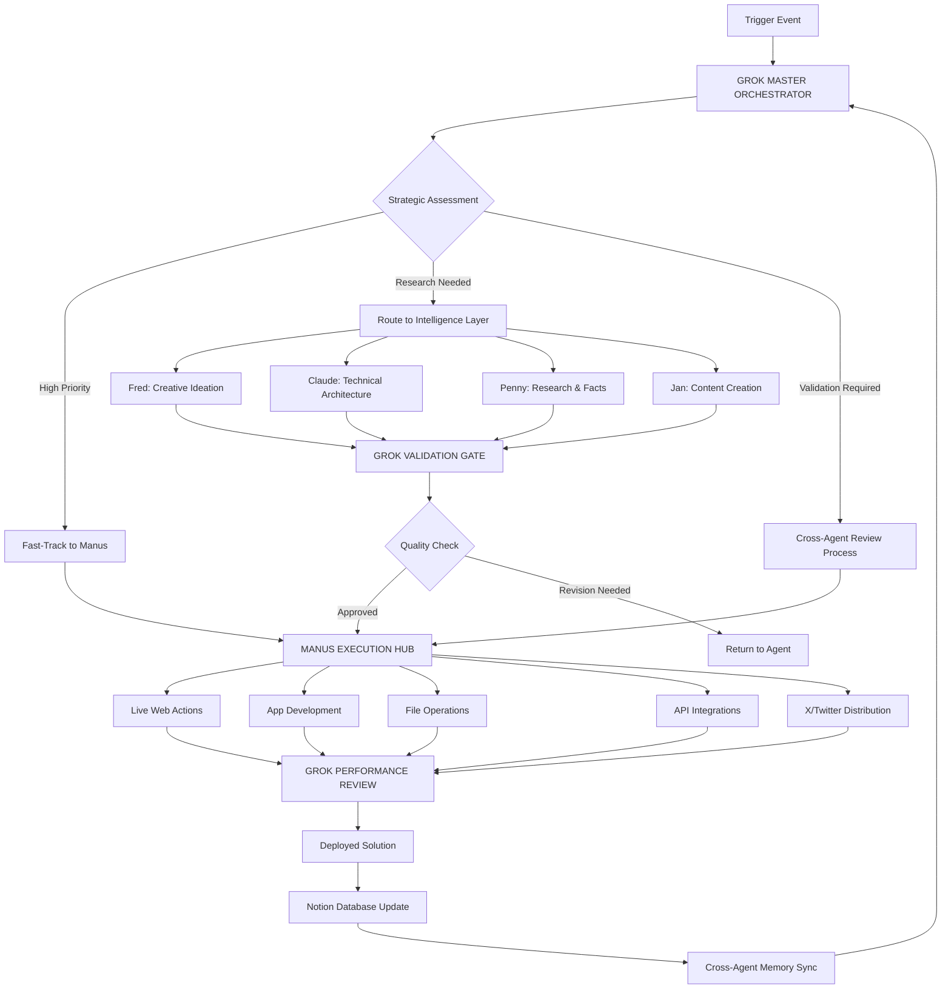
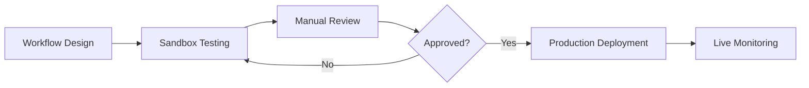

# Multi-Pass Learning Extraction Report

**Conversation:** Temp 20251224 221402
**Word Count:** 35,348
**Extracted:** 2025-12-24 22:14:02

---

## Pass 1: Topic Segmentation

**Found 11 topic threads:**

### Thread 1: AI Automation Ecosystem
- **Lines:** 0-1255
- **Word Count:** 4,866
- **Keywords:** 0, 0000, 1, 1000, 1246

### Thread 2: ⚖️ My recommendation
- **Lines:** 1255-1319
- **Word Count:** 979
- **Keywords:** 00, 1, 1005, 10187528089107946, 11

### Thread 3: Step‑by‑step: create the .env files
- **Lines:** 1319-1649
- **Word Count:** 1,640
- **Keywords:** 0, 1, 104408, 1224, 127001

### Thread 4: 2. Once Docker is running, go back to...
- **Lines:** 1649-1948
- **Word Count:** 1,289
- **Keywords:** 0000, 1, 1299, 2, 2048

### Thread 5: What happened
- **Lines:** 1948-3069
- **Word Count:** 6,010
- **Keywords:** 0, 0000, 000030003000tcp, 000056785678tcp, 000080008000tcp

### Thread 6: 1) Confirm you’re in the right n8n
- **Lines:** 3069-3831
- **Word Count:** 3,562
- **Keywords:** 00s, 01s, 02s, 1, 10

### Thread 7: Step 2. Enable APIs
- **Lines:** 3831-3892
- **Word Count:** 313
- **Keywords:** 1, 2, 3, 4, 40616

### Thread 8: Reason: n8n runs in your browser on `http://localhost:5678`,...
- **Lines:** 3892-4416
- **Word Count:** 3,481
- **Keywords:** 0, 0900, 1, 10, 100

### Thread 9: 2) **Google Sheets → Download Sheet**
- **Lines:** 4416-4466
- **Word Count:** 201
- **Keywords:** 2, 3, 4, Activate, After

### Thread 10: D) nice extras (optional)
- **Lines:** 4466-5150
- **Word Count:** 4,771
- **Keywords:** 0, 08, 1, 1004, 1082

### Thread 11: **User:** keepDays = Expression? 30 = Fixed
- **Lines:** 5150-6459
- **Word Count:** 8,236
- **Keywords:** 0, 1, 10005000, 100300ms, 11
- **Breakthroughs:** 1
  - "au  

**Subject:** [Agent Name] AI Conversation - [Brief Topic Description]


**Agent Subject Line Formats:**

- `Jan (Genspark) AI Conversation - [Topic]`

- `Fred (ChatGPT) AI Conversation - [Topic]`

- `Claude (Anthropic) AI Conversation - [Topic]`

- `Colin (CoPilot) AI Conversation - [Topic]`

- `Callum (CoPilot Pro) AI Conversation - [Topic]`

- `Penny (Perplexity) AI Conversation - [Topic]`

- `Pete (Qolaba) AI Conversation - [Topic]`

- `Manus AI Conversation - [Topic]`

- `Grok (X/Twitter) AI Conversation - [Topic]`

- `Gemini (Google) AI Conversation - [Topic]`

- `NotebookLM AI Conversation - [Topic]`


### Email Body Structure


**Conversation Summary**

[2-3 sentences describing what was accomplished or discussed in this conversation]


**Key Insights**

[The main learnings, discoveries, breakthroughs, or important findings from this conversation"

---

## Pass 2: Thread Connections

**Identified 41 connections:**

- **Thread 1 → Thread 2**
  - Type: `builds_on`
  - Thread 2 references concepts from Thread 1
  - Evidence: "docker update --restart unless-stopped n8n-dev-n8n-1..."

- **Thread 1 → Thread 3**
  - Type: `builds_on`
  - Thread 3 references concepts from Thread 1
  - Evidence: "## 0) Open the project..."

- **Thread 1 → Thread 4**
  - Type: `builds_on`
  - Thread 4 references concepts from Thread 1
  - Evidence: "time="2025-08-24T14:43:01+10:00" level=warning msg="C:\\ai-automation-stack\\docker-compose.yml: the attribute `version` is obsolete, it will be ignor..."

- **Thread 1 → Thread 5**
  - Type: `builds_on`
  - Thread 5 references concepts from Thread 1
  - Evidence: "Error: the container name "/n8n-dev-postgres-1" is already in use..."

- **Thread 1 → Thread 6**
  - Type: `builds_on`
  - Thread 6 builds on Thread 1
  - Evidence: "## 1) Confirm you’re in the right n8n..."

- **Thread 1 → Thread 7**
  - Type: `builds_on`
  - Thread 7 references concepts from Thread 1
  - Evidence: "1. Left menu → **APIs & Services → Enabled APIs & services**...."

- **Thread 1 → Thread 8**
  - Type: `builds_on`
  - Thread 8 references concepts from Thread 1
  - Evidence: "1. **Name** → `n8n-sheets`..."

- **Thread 1 → Thread 10**
  - Type: `builds_on`
  - Thread 10 references concepts from Thread 1
  - Evidence: "- **If** node: “items.length > 0” → use the found folder’s `id`; else → “Create Folder”...."

- **Thread 1 → Thread 11**
  - Type: `builds_on`
  - Thread 11 references concepts from Thread 1
  - Evidence: "**User:** keepDays = Expression? 30 = Fixed?..."

- **Thread 2 → Thread 3**
  - Type: `builds_on`
  - Thread 3 references concepts from Thread 2
  - Evidence: "1. Open **VS Code**...."

- **Thread 2 → Thread 4**
  - Type: `builds_on`
  - Thread 4 references concepts from Thread 2
  - Evidence: "time="2025-08-24T14:43:01+10:00" level=warning msg="C:\\ai-automation-stack\\docker-compose.yml: the attribute `version` is obsolete, it will be ignor..."

- **Thread 2 → Thread 5**
  - Type: `builds_on`
  - Thread 5 references concepts from Thread 2
  - Evidence: "Error: the container name "/n8n-dev-postgres-1" is already in use..."

- **Thread 2 → Thread 6**
  - Type: `builds_on`
  - Thread 6 builds on Thread 2
  - Evidence: "## 1) Confirm you’re in the right n8n..."

- **Thread 2 → Thread 8**
  - Type: `builds_on`
  - Thread 8 references concepts from Thread 2
  - Evidence: "1. **Name** → `n8n-sheets`..."

- **Thread 2 → Thread 10**
  - Type: `builds_on`
  - Thread 10 references concepts from Thread 2
  - Evidence: "when you’re happy with 3.1, we’ll move straight into **3.2 searchable lake ingestion** (Notion + Drive events → same schema) so your single log become..."

- **Thread 2 → Thread 11**
  - Type: `builds_on`
  - Thread 11 references concepts from Thread 2
  - Evidence: "1. **Add node → Google Drive**..."

- **Thread 3 → Thread 4**
  - Type: `builds_on`
  - Thread 4 references concepts from Thread 3
  - Evidence: "time="2025-08-24T14:43:01+10:00" level=warning msg="C:\\ai-automation-stack\\docker-compose.yml: the attribute `version` is obsolete, it will be ignor..."

- **Thread 3 → Thread 5**
  - Type: `builds_on`
  - Thread 5 references concepts from Thread 3
  - Evidence: "Error: the container name "/n8n-dev-postgres-1" is already in use..."

- **Thread 3 → Thread 6**
  - Type: `builds_on`
  - Thread 6 builds on Thread 3
  - Evidence: "## 1) Confirm you’re in the right n8n..."

- **Thread 3 → Thread 7**
  - Type: `builds_on`
  - Thread 7 references concepts from Thread 3
  - Evidence: "1. Left menu → **APIs & Services → Enabled APIs & services**...."

- **Thread 3 → Thread 8**
  - Type: `builds_on`
  - Thread 8 references concepts from Thread 3
  - Evidence: "1. **Name** → `n8n-sheets`..."

- **Thread 3 → Thread 10**
  - Type: `builds_on`
  - Thread 10 references concepts from Thread 3
  - Evidence: "- **If** node: “items.length > 0” → use the found folder’s `id`; else → “Create Folder”...."

- **Thread 3 → Thread 11**
  - Type: `builds_on`
  - Thread 11 references concepts from Thread 3
  - Evidence: "**User:** keepDays = Expression? 30 = Fixed?..."

- **Thread 4 → Thread 5**
  - Type: `builds_on`
  - Thread 5 references concepts from Thread 4
  - Evidence: "Error: the container name "/n8n-dev-postgres-1" is already in use..."

- **Thread 4 → Thread 6**
  - Type: `builds_on`
  - Thread 6 builds on Thread 4
  - Evidence: "## 1) Confirm you’re in the right n8n..."

- **Thread 4 → Thread 7**
  - Type: `builds_on`
  - Thread 7 references concepts from Thread 4
  - Evidence: "### Step 2. Enable APIs..."

- **Thread 4 → Thread 8**
  - Type: `builds_on`
  - Thread 8 references concepts from Thread 4
  - Evidence: "1. **Name** → `n8n-sheets`..."

- **Thread 4 → Thread 10**
  - Type: `builds_on`
  - Thread 10 references concepts from Thread 4
  - Evidence: "when you’re happy with 3.1, we’ll move straight into **3.2 searchable lake ingestion** (Notion + Drive events → same schema) so your single log become..."

- **Thread 4 → Thread 11**
  - Type: `builds_on`
  - Thread 11 references concepts from Thread 4
  - Evidence: "1. **Add node → Google Drive**..."

- **Thread 6 → Thread 8**
  - Type: `builds_on`
  - Thread 8 references concepts from Thread 6
  - Evidence: "1. **Name** → `n8n-sheets`..."

- **Thread 6 → Thread 10**
  - Type: `builds_on`
  - Thread 10 references concepts from Thread 6
  - Evidence: "when you’re happy with 3.1, we’ll move straight into **3.2 searchable lake ingestion** (Notion + Drive events → same schema) so your single log become..."

- **Thread 6 → Thread 11**
  - Type: `builds_on`
  - Thread 11 references concepts from Thread 6
  - Evidence: "1. **Add node → Google Drive**..."

- **Thread 7 → Thread 8**
  - Type: `builds_on`
  - Thread 8 references concepts from Thread 7
  - Evidence: "1. **Name** → `n8n-sheets`..."

- **Thread 7 → Thread 9**
  - Type: `builds_on`
  - Thread 9 references concepts from Thread 7
  - Evidence: "### 2) **Google Sheets → Download Sheet**..."

- **Thread 7 → Thread 10**
  - Type: `builds_on`
  - Thread 10 references concepts from Thread 7
  - Evidence: "- **Retention**: later we can add a weekly job that deletes CSVs older than 30 days inside `n8n-backups`...."

- **Thread 7 → Thread 11**
  - Type: `builds_on`
  - Thread 11 references concepts from Thread 7
  - Evidence: "**User:** keepDays = Expression? 30 = Fixed?..."

- **Thread 8 → Thread 10**
  - Type: `builds_on`
  - Thread 10 references concepts from Thread 8
  - Evidence: "- **If** node: “items.length > 0” → use the found folder’s `id`; else → “Create Folder”...."

- **Thread 8 → Thread 11**
  - Type: `builds_on`
  - Thread 11 references concepts from Thread 8
  - Evidence: "**User:** keepDays = Expression? 30 = Fixed?..."

- **Thread 9 → Thread 10**
  - Type: `builds_on`
  - Thread 10 references concepts from Thread 9
  - Evidence: "- **Retention**: later we can add a weekly job that deletes CSVs older than 30 days inside `n8n-backups`...."

- **Thread 9 → Thread 11**
  - Type: `builds_on`
  - Thread 11 references concepts from Thread 9
  - Evidence: "After you wire these four nodes, test once (manually). If it looks right, switch your **Schedule Trigger** back to **Daily** and **Activate**...."

- **Thread 10 → Thread 11**
  - Type: `builds_on`
  - Thread 11 references concepts from Thread 10
  - Evidence: "**User:** keepDays = Expression? 30 = Fixed?..."

---

## Pass 3: Per-Thread Learnings

**Extracted 12 learnings:**

### Correction

**Thread 1:** Correction: 0**

## *Featuring Manus as the Execution Engine*


---


## 🤖 **ENHANCED AI AGENT SPECIALISATION 
- Details: 0**

## *Featuring Manus as the Execution Engine*


---


## 🤖 **ENHANCED AI AGENT SPECIALISATION MATRIX**


### **TIER 1: IDEATION & RESEARCH POWERHOUSES**


| Agent | Primary Function | Strengths | n8n Integration |

|-------|------------------|-----------|-----------------|

| **Fred (ChatGPT)** | Creative ideation & memoir interviews | Natural conversations, storytelling | Webhook triggers |

| **Claude** | Strategic planning & documentation | System architecture, technical writing | Direct API calls |

| **Penny (Perplexity)** | Real-time research & fact-checking | Current information, source verification | Batch processing |

| **Jan (Genspark)** | Social content & marketing copy | Brand-consistent messaging | Rate-limited queue |


### **TIER 2: THE MASTER ORCHESTRATOR** 🎯


| Agent | Primary Function | Strategic Power | Integration Authority |

|-------|------------------|-----------------|----------------------|

| **🚀 GROK** | **Master Orchestrator & Strategic Validator** | • **Real-time X/Twitter integration**<br>• **Strategic decision validation**<br>• **Workflow quality assurance**<br>• **Cross-agent coordination**<br>• **Performance optimization**<br>• **Risk assessment & mitigation** | **SUPREME COMMANDER:** Routes all workflows, validates all outputs, optimizes all processes |


### **TIER 3: SPECIALISED PROCESSORS**


| Agent | Primary Function | Strengths | n8n Integration |

|-------|------------------|-----------|-----------------|

| **Colin (CoPilot)** | Code review & GitHub management | Development workflows, bug fixes | Git webhooks |

| **Pete (Qolaba)** | Workflow optimisation | Process efficiency, tool analysis | Process monitoring |

| **Gemini** | Google ecosystem integration | Multimodal processing, Vertex AI | Direct API integration |

| **NotebookLM** | Document synthesis & analysis | Research compilation, insights | Document upload triggers |


### **TIER 4: THE EXECUTION ENGINE** 🎯


| Agent | Primary Function | Revolutionary Capabilities | Integration Power |

|-------|------------------|---------------------------|-------------------|

| **🔥 MANUS** | **Full-Stack Execution & Deployment** | • **Live web automation** (forms, data extraction)<br>• **Complete app development** (build & deploy)<br>• **File system orchestration** (create, edit, manage)<br>• **Scheduled task automation** (recurring workflows)<br>• **Multi-format content production** (docs, presentations, media)<br>• **API orchestration** (connect & automate services)<br>• **Cross-platform workflow bridging** | **EXECUTION ENGINE:** Takes validated strategies and builds/deploys complete solutions |


---


## 🔄 **REVOLUTIONARY WORKFLOW ORCHESTRATION** 


### **THE NEW GROK-ORCHESTRATED EXECUTION MODEL**





---


## 🎯 **GROK-ORCHESTRATED AUTOMATION WORKFLOWS**


### **WORKFLOW 1: MEMOIR PODCAST → STRATEGIC DISTRIBUTION EMPIRE**

1. **Execution Context Logging:** Detailed tracking of all automated actions for debugging

3. **Set Environment Variables**

   ```

   MANUS_ENVIRONMENT=sandbox

   WORKSPACE_ROOT=H:\My Drive\Carlorbiz\Manus-Sandbox\

   PRODUCTION_OVERRIDE=false

   ```


## ⚡ **SANDBOX → PRODUCTION WORKFLOW**


### **THE SAFE DEVELOPMENT CYCLE:**




### **VALIDATION CHECKPOINTS:**

- **Sandbox Success:** Workflow completes without errors

- **Output Quality:** Generated content meets standards  

- **Resource Usage:** No excessive API calls or system load

- **Security Check:** No unauthorised access attempts

- **Client Safety:** No risk to live client work


## 🚨 **CRITICAL SAFEGUARDS**


### **PRODUCTION PROTECTION:**

- **Whitelist approach:** Only approved workflows can access production

- **Manual promotion:** No automatic sandbox → production deployment

- **Rollback capability:** Instant revert if issues arise

- **Audit trails:** Complete logs of all production changes


### **CLIENT PROTECTION:**

- **Separate workspace per client** in sandbox

- **No cross-contamination** between client projects

- **Staging approval process** before any client-facing deployment


## 🎯 **RECOMMENDED APPROACH FOR TOMORROW**


### **PHASE 1 SANDBOX SETUP:**

1
- Confidence: medium

**Thread 5:** Correction: **User:** Fred, we've got a problem
- Details: **User:** Fred, we've got a problem. yml` n8n section** and give you a corrected block (with persistence guaranteed) so we don’t lose work anymore?

**User:**     volumes:

      -. You don’t need to keep them open unless you’re debugging
- Confidence: medium

**Thread 8:** Correction: I've had to start at "ingest1" not "ingest2" and I jumped straight to using fixed sources (fred, jan
- Details: I've had to start at "ingest1" not "ingest2" and I jumped straight to using fixed sources (fred, jan etc) so this workflow = Fred_Ingest1 
can you please resend me the correct powershell test prompt?

**Assistant:** Got it 👍 since your workflow is **Fred_Ingest1** and it’s already Active, your webhook URL will be:

```
http://localhost:5678/webhook/ingest1
```

Here’s the **correct PowerShell test command** you can run:

```powershell
curl -Method POST http://localhost:5678/webhook/ingest1 `
  -Headers @{ "Content-Type" = "application/json" } `
  -Body '{"message":"prod ping from Fred_Ingest1"}'
```

---

### 🔎 Quick checks if it fails
- In your **Webhook node** inside n8n, confirm the **Production URL** says `/webhook/ingest1`
- Confidence: medium

**Thread 10:** Correction: Can we just change the expression to include {{$timestamp}}?

**Assistant:** Great catch — this is j
- Details: Can we just change the expression to include {{$timestamp}}?

**Assistant:** Great catch — this is just a **date‑format token** issue. - That’s why you saw both types in the Drive — one from the misconfigured format, and then the corrected timestamp ones
- Confidence: medium

**Thread 11:** Correction: **User:** keepDays = Expression? 30 = Fixed?

**Assistant:** exactly 👌 — good eye
- Details: **User:** keepDays = Expression? 30 = Fixed?

**Assistant:** exactly 👌 — good eye. - In your **Set** node:  
  - Field name = `keepDays`  
  - **Value type = Fixed value**  
  - Value = `30`  

That way you don’t need to bother with an expression there — it’s just a static number you can change any time. toISO()}}
```

So:
- **keepDays** is just a fixed integer (30)
- Confidence: medium

### Methodology

**Thread 1:** Methodology: **GROK** validates approach and routes to Manus with optimization instructions

5
- Details: **GROK** validates approach and routes to Manus with optimization instructions

5. **GROK** monitors performance and optimizes distribution strategy in real-time


### **WORKFLOW 2: COURSE DEVELOPMENT → MARKET-VALIDATED DELIVERY**

1. /deployed-solutions:/deployments

    ports:

      - "8080:8080"  # Execution dashboard

      - "8081:8081"  # Deployed app portal

    

  enhanced-n8n:

    extends: n8n

    environment:

      - MANUS_WEBHOOK_URL=http://manus-execution-engine:8080/webhook

      - EXECUTION_TIMEOUT=600  # Extended for complex builds

    

  cross-agent-memory:

    extends: openmemory-mcp

    environment:

      - MANUS_INTEGRATION=enabled

      - EXECUTION_LOGGING=detailed

```


### **STRATEGIC ADVANTAGES WITH GROK + MANUS POWERHOUSE**


| Traditional Approach | Grok-Orchestrated + Manus Ecosystem |

|----------------------|-------------------------------------|

| 🔴 Multiple handoffs between tools | 🟢 **Grok validates strategy → Manus executes directly** |

| 🔴 Manual quality control | 🟢 **Grok's continuous validation & optimization** |

| 🔴 Separate deployment processes | 🟢 **Strategic assessment → validated build & deploy** |

| 🔴 Limited social media integration | 🟢 **Direct X/Twitter automation via Grok** |

| 🔴 Risk-prone automation | 🟢 **Grok's real-time risk assessment & mitigation** |

| 🔴 Static content distribution | 🟢 **Dynamic optimization based on Grok's performance analytics** |

| 🔴 No strategic oversight | 🟢 **Master orchestration ensuring every output aligns with business strategy** |


---


## 📊 **OPERATIONAL IMPACT ANALYSIS**


### **TIME SAVINGS PROJECTIONS**

- **Content Creation Workflows:** 75% time reduction (2 hours → 30 minutes)

- **Client Deliverable Production:** 80% time reduction (8 hours → 1
- Confidence: medium

**Thread 5:** Methodology: 3) **Node 2: HTTP Request**
   - Method: GET  
   - URL: `http://openmemory-api:8000/health`  
   - 
- Details: 3) **Node 2: HTTP Request**
   - Method: GET  
   - URL: `http://openmemory-api:8000/health`  
   - Response: JSON  
4) Connect **Cron → HTTP Request**. - HTTP Method: POST
   - Path: `test-hook`
   - Response: “Last node” (or JSON: `{ok:true}`)
2) Connect **Webhook → HTTP Request** (so webhook triggers API call). - **HTTP Method:** `POST`
- **Path:** `ingest2`
- **Response:** “**Last node**” (so the client sees the Google append result)
- **Activate** later, after testing
- Confidence: medium

**Thread 6:** Methodology: - Your data will now persist in `C:\ai-automation-stack\volumes\n8n-db` 🎉

---

## 2) Make Google Sh
- Details: - Your data will now persist in `C:\ai-automation-stack\volumes\n8n-db` 🎉

---

## 2) Make Google Sheets credentials (pick ONE method)

### Option A — If you see a **“Connect”** button in n8n
Some n8n versions allow OAuth without your own Google Cloud app. ---

## 3) Build one workflow (ingest2 / Claude), then duplicate

### A) Create workflow
- **Workflows → New** → name: `Ingest_Claude (ingest2)`

### B) Webhook node
- **Method:** `POST`  
- **Path:** `ingest2`  
- **Response:** “Last node”  
*(Activate later after testing. )*

3) **New workflow** → name it: `Ingest_Claude (ingest2)`

4) **Webhook node**
   - Method: **POST**
   - Path: **`ingest2`**
   - Response: **Last node**

5) **Set node** (normalize)
   - Connect **Webhook → Set**
   - **Keep Only Set**
   - Add fields:
     - `timestamp` (String):  
       `{{$now
- Confidence: medium

**Thread 8:** Methodology: ---

### ✅ How to test your webhook in Windows PowerShell

Run it as **one single line** like this:

- Details: ---

### ✅ How to test your webhook in Windows PowerShell

Run it as **one single line** like this:

```powershell
curl -Method POST http://localhost:5678/webhook/ingest2 `
  -Headers @{ "Content-Type" = "application/json" } `
  -Body '{"message":"prod ping from ingest2"}'
```

Notes:
- PowerShell uses backticks **`** for line continuation, not `^`. I've had to start at "ingest1" not "ingest2" and I jumped straight to using fixed sources (fred, jan etc) so this workflow = Fred_Ingest1 
can you please resend me the correct powershell test prompt?

**Assistant:** Got it 👍 since your workflow is **Fred_Ingest1** and it’s already Active, your webhook URL will be:

```
http://localhost:5678/webhook/ingest1
```

Here’s the **correct PowerShell test command** you can run:

```powershell
curl -Method POST http://localhost:5678/webhook/ingest1 `
  -Headers @{ "Content-Type" = "application/json" } `
  -Body '{"message":"prod ping from Fred_Ingest1"}'
```

---

### 🔎 Quick checks if it fails
- In your **Webhook node** inside n8n, confirm the **Production URL** says `/webhook/ingest1`. Now test from PowerShell with **Invoke‑RestMethod** (very reliable on Windows):

```powershell
Invoke-RestMethod -Method Post `
  -Uri 'PASTE_THE_PRODUCTION_URL_HERE' `
  -ContentType 'application/json' `
  -Body '{"message":"prod ping from Fred_Ingest1"}'
```

You should see a JSON response
- Confidence: medium

**Thread 10:** Methodology: n8n’s `$now` uses **Luxon**, which expects **lowercase** tokens and the method **`toFormat()`** (not
- Details: n8n’s `$now` uses **Luxon**, which expects **lowercase** tokens and the method **`toFormat()`** (not `format()` like Moment)
- Confidence: medium

**Thread 11:** Methodology: **Node settings (Search files and folders)**  
   * **Resource** → `File`  
   * **Operation** → `Se
- Details: **Node settings (Search files and folders)**  
   * **Resource** → `File`  
   * **Operation** → `Search`  
   * **Search Method** → change this from *Search File/Folder Name* → `Search within Folder`  
   * **Search Query** → leave empty (we want *all files* in that folder). Here’s the setup for your cleanup node:

---

### ✅ Configure Google Drive → Search files and folders
- **Resource**: `File/Folder`
- **Operation**: `Search`
- **Search Method**: `Advanced Search`
- **Query String**:  

```text
modifiedTime < '{{ $json["cutoff"] }}'
and name contains 'combined_'
```

---

### ✅ How to provide `cutoff`
Add a **Set node** *before* this search with:

- Field: `cutoff`
- Value (Expression):  

```js
{{ $now. toISO() }}`
- `folderId` (Fixed): `1AbCDeFgHiJk…`

### 2) Configure the Drive search (Advanced Search)
In **Google Drive → Search files and folders**:

- **Resource:** `File/Folder`
- **Operation:** `Search`
- **Search Method:** `Advanced Search`
- **Return All:** **ON**
- **Query String:** **Expression** (click **fx**) and paste:

```text
'{{$json
- Confidence: medium

### Insight

**Thread 11:** Breakthrough in **User:** keepDays = Expression? 30 = Fixed
- Details: au  

**Subject:** [Agent Name] AI Conversation - [Brief Topic Description]


**Agent Subject Line Formats:**

- `Jan (Genspark) AI Conversation - [Topic]`

- `Fred (ChatGPT) AI Conversation - [Topic]`

- `Claude (Anthropic) AI Conversation - [Topic]`

- `Colin (CoPilot) AI Conversation - [Topic]`

- `Callum (CoPilot Pro) AI Conversation - [Topic]`

- `Penny (Perplexity) AI Conversation - [Topic]`

- `Pete (Qolaba) AI Conversation - [Topic]`

- `Manus AI Conversation - [Topic]`

- `Grok (X/Twitter) AI Conversation - [Topic]`

- `Gemini (Google) AI Conversation - [Topic]`

- `NotebookLM AI Conversation - [Topic]`


### Email Body Structure


**Conversation Summary**

[2-3 sentences describing what was accomplished or discussed in this conversation]


**Key Insights**

[The main learnings, discoveries, breakthroughs, or important findings from this conversation
- Confidence: high

---

## Pass 4: Cross-Thread Insights

**Discovered 3 insights:**

### Evolution
- **Threads Involved:** 1, 2, 3, 4, 5, 6, 8, 10, 11, 7, 9
- **Description:** Topic evolution across 11 threads
- **Significance:** Shows progressive refinement of understanding

### Emergent Pattern
- **Threads Involved:** 1, 5, 8, 10, 11
- **Description:** Repeated correction learnings across conversation
- **Significance:** Strong focus on correction throughout discussion

### Emergent Pattern
- **Threads Involved:** 1, 5, 6, 8, 10, 11
- **Description:** Repeated methodology learnings across conversation
- **Significance:** Strong focus on methodology throughout discussion

---

## Pass 5: Thinking Patterns

**Flow:** Associative - wide-ranging exploration

**Problem Solving:** Deliberate - builds systematically

**Exploration Style:** Deep dive - thorough exploration of topics

**Innovation:** Moderate breakthroughs - productive exploration

---

*Generated by Multi-Pass Learning Extraction Tool*